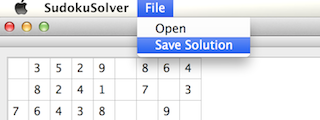

Sudoku puzzle solver
============

The Sudoku puzzle solver aims to solving 9x9 [*Sudoku puzzles*](http://www.sudoku.name/rules/en). It reads puzzle from a **CSV file**, with 0's representing blanks. The solver solves puzzle using **recursive backtracking** algorithm. The solution can be saved to a CSV file.

The code was written in **C++** using **Qt Creator** for cross-platform use. SudokuSolver.app running on Mac OS X and SudokuSolver.exe running on Windows were uploaded. 

<h3>How to use
----------------------
**1. Load a .csv file.**

**2. Error message pop up if the input is not a validate Sudoku puzzle.**

 
 

**3. Click the 'Solve puzzle' button.**

**4. Solution shows in the bottom table.**

**5. Save solution to a .csv file.**

